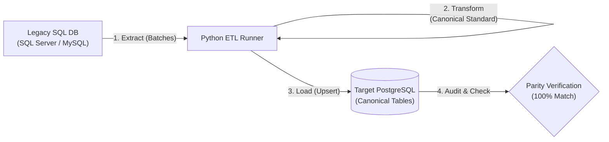

# Relational SQL to PostgreSQL Migration Strategy & Canonical Data Modelling

---

## 1. Objective & Scope

This proposal outlines the technical strategy for migrating our legacy **Relational SQL database** (e.g., MS SQL Server / MySQL) to **PostgreSQL**, adopting an enterprise **Canonical Data Model (CDM)**.

Rather than executing a direct lift-and-shift of legacy tables, this approach:
- Standardizes naming, primary keys, and data types across all modules.
- Modernizes procedural and dialect-specific features to PostgreSQL-native standards.
- Establishes a clean, maintainable target schema that decouples downstream APIs and services from legacy technical debt.

---

## 2. Canonical Data Model (CDM) Standards

All target PostgreSQL tables and schemas will adhere to the following enterprise design standards:

### 2.1 Identifier & Naming Conventions
- **Case & Delimiters**: Lowercase `snake_case` across all schemas, tables, columns, constraints, and indexes.
- **Table Names**: Consistent entity naming in singular (e.g., `student`, `course`, `fee_transaction`).
- **Foreign Keys**: Formatted as `{referenced_table}_id` referencing the canonical entity ID.
- **Index Naming**:
  - B-tree: `idx_{table}_{column}`
  - Unique: `uq_{table}_{column}`
  - GIN (JSONB / Array): `idx_{table}_{column}_gin`

### 2.2 Primary Key Strategy
- **Entities**: Default to **`UUID v4`** for all domain entities to support distributed generation and avoid collision risks.
  ```sql
  CREATE EXTENSION IF NOT EXISTS "pgcrypto";
  
  CREATE TABLE student (
      id UUID PRIMARY KEY DEFAULT gen_random_uuid(),
      ...
  );
  ```
- **High-Volume Transaction Logs**: Use `BIGINT GENERATED ALWAYS AS IDENTITY PRIMARY KEY` where sequential numerical ordering is strictly required.

### 2.3 Uniform Audit Trail
Every canonical entity table includes standard audit columns:
```sql
created_on   TIMESTAMPTZ NOT NULL DEFAULT CURRENT_TIMESTAMP,
created_by   UUID,
modified_on  TIMESTAMPTZ,
modified_by  UUID
```

An automated trigger maintains `modified_on` across updates without requiring application-level boilerplate:
```sql
CREATE OR REPLACE FUNCTION update_modified_on_column()
RETURNS TRIGGER AS $$
BEGIN
    NEW.modified_on = CURRENT_TIMESTAMP;
    RETURN NEW;
END;
$$ LANGUAGE plpgsql;

CREATE TRIGGER trg_student_modified_on
BEFORE UPDATE ON student
FOR EACH ROW EXECUTE FUNCTION update_modified_on_column();
```

### 2.4 Statuses & Enums
Replace magic integers (`Status = 1`) or arbitrary text flags with native PostgreSQL `ENUM` types for type safety and self-documenting schemas:
```sql
CREATE TYPE student_status_enum AS ENUM (
    'Pending',
    'Active',
    'Suspended',
    'Graduated',
    'Withdrawn'
);

ALTER TABLE student ADD COLUMN status student_status_enum NOT NULL DEFAULT 'Pending';
```

### 2.5 Semi-Structured Data Handling (`JSONB`)
Where legacy schemas feature denormalized attributes, dynamic metadata, or key-value tables, leverage PostgreSQL **`JSONB`** indexed with **`GIN`**:
```sql
ALTER TABLE student ADD COLUMN attributes JSONB DEFAULT '{}'::jsonb;
CREATE INDEX idx_student_attributes_gin ON student USING GIN (attributes);
```

---

## 3. Relational Type & Dialect Mapping

The following mapping translates legacy relational database types to our canonical PostgreSQL schema:

| Source (SQL Server / MySQL) | PostgreSQL Canonical Type | Rational & Translation Rule |
|---|---|---|
| `UNIQUEIDENTIFIER` / `CHAR(36)` | `UUID` | Native 128-bit UUID type with index efficiency. |
| `INT IDENTITY` / `AUTO_INCREMENT` | `BIGINT GENERATED ALWAYS AS IDENTITY` | Standard SQL-conforming auto-incrementing identity. |
| `DATETIME`, `DATETIME2`, `DATETIME` | `TIMESTAMPTZ` | Normalized to UTC with timezone awareness. |
| `DATE` | `DATE` | Standard calendar date without time component. |
| `VARCHAR(n)`, `NVARCHAR(n)` | `VARCHAR(n)` | Character length enforced where business constraints exist. |
| `NVARCHAR(MAX)`, `TEXT`, `LONGTEXT` | `TEXT` | PostgreSQL `TEXT` carries no performance penalty over `VARCHAR`. |
| `BIT`, `TINYINT(1)` | `BOOLEAN` | Native boolean (`true` / `false`). |
| `DECIMAL(p, s)`, `MONEY` | `NUMERIC(p, s)` | Fixed-point arbitrary precision arithmetic for financial data. |
| `NVARCHAR(MAX)` (JSON blobs) | `JSONB` | Decomposed binary JSON storage with GIN index acceleration. |
| `GETDATE()`, `SYSDATETIME()`, `NOW()` | `CURRENT_TIMESTAMP` | ANSI SQL standard UTC timestamp. |

---


## 4. Migration Architecture & Execution Pipeline



The migration follows a straightforward 4-step process:

1. **Extract**: Read data from the legacy SQL database in batches (e.g., 5,000 rows at a time) to keep memory usage minimal.
2. **Transform**: Convert fields into the canonical standard (format UUIDs, cast dates to UTC, and map status numbers to Postgres ENUMs).
3. **Load**: Bulk-insert into PostgreSQL using `execute_values` with `ON CONFLICT (id) DO UPDATE` for safe, repeatable runs.
4. **Verify**: Compare row counts and validate sample records to confirm zero data loss.

---

## 5. Python Migration Script Pattern

The following production-ready ETL pattern demonstrates the migration architecture:

```python
"""
Canonical ETL Migration Runner: Relational SQL to PostgreSQL
"""
import os
import uuid
from datetime import datetime, timezone
import pyodbc    # For MS SQL Server (or pymysql / mysql-connector for MySQL)
import psycopg2
from psycopg2.extras import execute_values

# ---------------------------------------------------------------------------
# 1. Row Transformation to Canonical Contract
# ---------------------------------------------------------------------------
def transform_student_row(source_row: dict) -> tuple:
    """
    Transforms legacy SQL record into canonical PostgreSQL tuple.
    Handles UUID parsing, UTC normalization, and status ENUM translation.
    """
    raw_id = source_row.get("StudentID")
    canonical_id = str(uuid.UUID(str(raw_id))) if raw_id else str(uuid.uuid4())

    created_date = source_row.get("CreatedDate")
    if created_date and isinstance(created_date, datetime) and created_date.tzinfo is None:
        created_date = created_date.replace(tzinfo=timezone.utc)

    # Legacy Status code to PostgreSQL ENUM mapping
    status_map = {1: "Active", 2: "Pending", 3: "Suspended", 99: "Withdrawn"}
    canonical_status = status_map.get(source_row.get("StatusCode"), "Pending")

    return (
        canonical_id,
        (source_row.get("StudentNo") or "").strip(),
        (source_row.get("FirstName") or "").strip(),
        (source_row.get("LastName") or "").strip(),
        (source_row.get("EmailAddress") or "").strip().lower() or None,
        canonical_status,
        created_date or datetime.now(timezone.utc),
        None  # modified_on
    )

# ---------------------------------------------------------------------------
# 2. Migration Execution Worker
# ---------------------------------------------------------------------------
def migrate_students(batch_size: int = 5000):
    src_conn = pyodbc.connect(os.getenv("SOURCE_SQL_CONN_STR"))
    pg_conn = psycopg2.connect(os.getenv("TARGET_PG_CONN_STR"))

    src_cur = src_conn.cursor()
    pg_cur = pg_conn.cursor()

    try:
        # Step A: Apply Canonical DDL
        pg_cur.execute("""
            CREATE EXTENSION IF NOT EXISTS "pgcrypto";

            DO $$ BEGIN
                CREATE TYPE student_status_enum AS ENUM ('Pending', 'Active', 'Suspended', 'Withdrawn');
            EXCEPTION
                WHEN duplicate_object THEN null;
            END $$;

            CREATE TABLE IF NOT EXISTS student (
                id UUID PRIMARY KEY,
                student_number VARCHAR(50) NOT NULL,
                first_name VARCHAR(100) NOT NULL,
                last_name VARCHAR(100) NOT NULL,
                email VARCHAR(255),
                status student_status_enum NOT NULL DEFAULT 'Pending',
                created_on TIMESTAMPTZ NOT NULL DEFAULT CURRENT_TIMESTAMP,
                modified_on TIMESTAMPTZ
            );

            CREATE INDEX IF NOT EXISTS idx_student_email ON student(email);
        """)
        pg_conn.commit()

        # Step B: Stream from Source & Load to Target
        src_cur.execute("""
            SELECT StudentID, StudentNo, FirstName, LastName, EmailAddress, StatusCode, CreatedDate 
            FROM tbl_Student
        """)
        columns = [col[0] for col in src_cur.description]

        insert_sql = """
            INSERT INTO student (
                id, student_number, first_name, last_name, email, status, created_on, modified_on
            ) VALUES %s
            ON CONFLICT (id) DO UPDATE SET
                student_number = EXCLUDED.student_number,
                first_name     = EXCLUDED.first_name,
                last_name      = EXCLUDED.last_name,
                email          = EXCLUDED.email,
                status         = EXCLUDED.status,
                modified_on    = CURRENT_TIMESTAMP;
        """

        total_loaded = 0
        while True:
            rows = src_cur.fetchmany(batch_size)
            if not rows:
                break

            batch = [transform_student_row(dict(zip(columns, r))) for r in rows]
            execute_values(pg_cur, insert_sql, batch, page_size=batch_size)
            pg_conn.commit()

            total_loaded += len(batch)
            print(f"Ingested batch: {len(batch)} records | Total: {total_loaded}")

        print(f"Migration finished successfully. Total records migrated: {total_loaded}")

    finally:
        src_cur.close()
        src_conn.close()
        pg_cur.close()
        pg_conn.close()

if __name__ == "__main__":
    migrate_students()
```

---

## 6. Verification & Parity Audit

To guarantee zero data loss, the pipeline executes an automated post-migration parity check:

1. **Row Count Parity**: Verifies `source_count == target_count`.
2. **Key Parity**: Ensures 0 missing IDs and 0 extraneous records in PostgreSQL.
3. **Data Parity Sample**: Samples 100 rows per domain across numerical and date fields to verify accuracy after type transformation.
4. **Audit Artifact**: Produces a standardized JSON report verifying parity before signing off on migration:
   ```json
   {
     "status": "PASS",
     "source_count": 15420,
     "pg_count": 15420,
     "missing_in_pg": 0,
     "extra_in_pg": 0,
     "field_mismatches": 0
   }
   ```

---

## 7. Project Kickoff Prerequisites

To initiate schema mapping and script development, the following inputs are required from the engineering team:

1. **Source SQL Dialect**: Confirm the database engine (MS SQL Server, MySQL, Oracle).
2. **Schema Definition / DDL Export**: A `.sql` schema dump or staging database credentials for source table introspection.
3. **Phase 1 Priority Scope**: List of core domain tables slated for initial migration.
