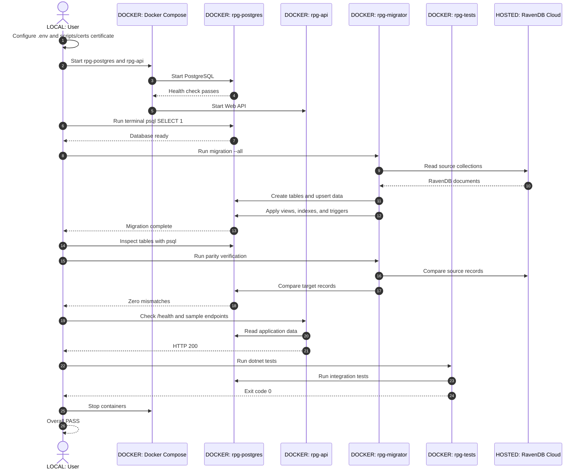

# CT-RPG Playbook Flow

## Runtime Locations

- LOCAL: `.env`, terminal `psql`, `curl`, and commands.
- DOCKER: PostgreSQL, API, migration, and test containers.
- HOSTED: RavenDB Cloud source database.
