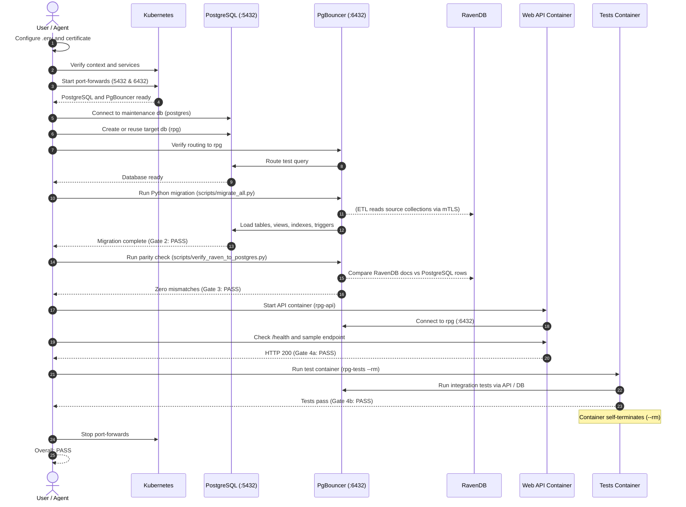

# CT-RPG Work Process

Runtime summary:

- Docker: one persistent `rpg-api` container and one temporary `rpg-tests` container.
- Kubernetes: PostgreSQL and PgBouncer.
- Migration: runs locally with Python.
